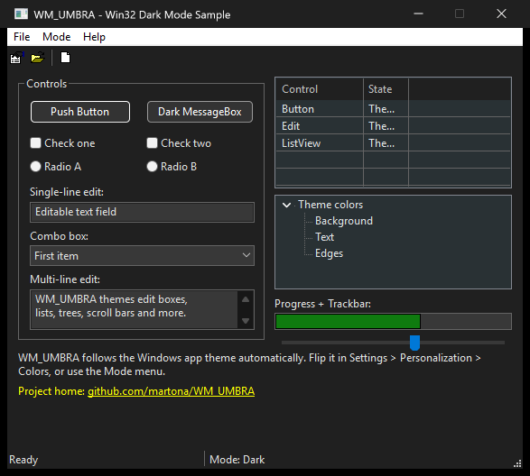
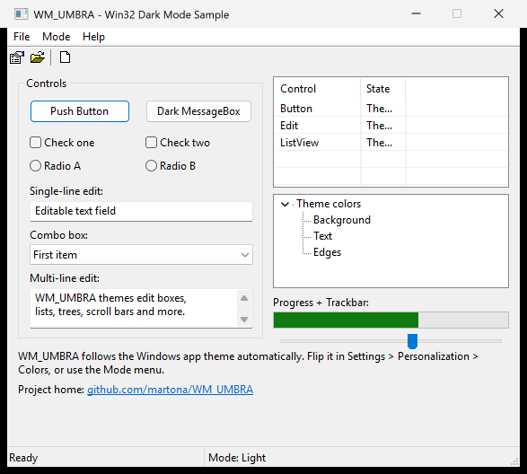

# WM_UMBRA

**Native dark mode for classic Win32 applications.**

[](https://github.com/martona/WM_UMBRA/actions)
[](https://github.com/martona/WM_UMBRA/releases/latest)
[](./LICENSE.md)

WM_UMBRA is a lightweight C++ static library that brings native dark mode to
classic Win32 / Common-Controls applications on Windows 10 (1809+) and Windows
11 — no UWP/XAML, no rewrite. Drop in the `umbra` static library, call two
functions, and your dialogs, menus, and common controls follow the system
light/dark theme.

| Dark | Light |
| :---: | :---: |
|  |  |

## Features

- 🖤 Native dark mode for classic Win32 windows, dialogs, and common controls
- 🪟 Dark title bar, menus, scroll bars, list/tree views, and a dark-aware `MessageBox`
- 🔄 Follows the OS app theme and re-themes **live** on `WM_SETTINGCHANGE`
- 🧩 Hooks the system theming/`GetSysColor` paths for consistent results
- 🏗️ Builds for **x86, x64, and ARM64**; ships an MSBuild solution **and** a CMake project
- 🔧 Static library, no runtime dependencies

## Requirements

- Windows 10 version 1809 (build 17763) or later, or Windows 11
- A C++20 toolchain (Visual Studio 2022/2026, MSVC v143+)
- Your app must use **Common Controls v6** (the usual themed-controls manifest)

## Quick start

Link `umbra.lib`, add the `include/` directory, and:

```cpp
#include <umbra.h>

// Once, during start-up (before creating windows). Follows the OS theme.
umbra::initDarkMode();

// After creating a top-level window or dialog — themes it and all children,
// wires up WM_CTLCOLOR* handling, custom draw, and the dark title bar:
umbra::setDarkWndNotifySafe(hWnd);

// Re-theme live when the user flips the Windows light/dark setting:
case WM_SETTINGCHANGE:
    if (umbra::handleSettingChange(lParam))
        umbra::setDarkWndNotifySafe(hWnd);
    break;

// A dark-mode-aware MessageBox:
umbra::DarkMessageBox(hWnd, L"Hello from the dark side.", L"WM_UMBRA", MB_OK);
```

A complete, runnable example lives in [`sample/`](sample) — a dialog with a
menu, toolbar, status bar, the full control zoo, and a `Mode` menu to force
dark/light/system.

## Building

WM_UMBRA ships two coexisting build systems. Both write their output under
`build/`.

**MSBuild / Visual Studio**

```powershell
# open umbra.sln in Visual Studio, or:
msbuild umbra.sln /m /p:Configuration=Release /p:Platform=x64
```

Configurations are `Debug`/`Release`; platforms are `Win32`, `x64`, and `ARM64`.
The solution builds the `umbra` static library and the `umbra-sample` app.

**CMake (with presets)**

```powershell
cmake --preset x64-static
cmake --build --preset x64-static-release
```

Presets cover the full matrix — `{x86, x64, arm64}` × `{static CRT, dynamic
CRT}`, each multi-config (`Debug`/`Release`):

| | static CRT (`/MT`) | dynamic CRT (`/MD`) |
| --- | --- | --- |
| **x64** | `x64-static` | `x64-dynamic` |
| **x86** | `x86-static` | `x86-dynamic` |
| **ARM64** | `arm64-static` | `arm64-dynamic` |

> **CRT note:** WM_UMBRA is a *static* library, so its C-runtime model is baked
> into the objects. Build (and consume) the variant whose CRT matches your
> application — `/MT(d)` with a static-CRT app, `/MD(d)` with a dynamic-CRT app —
> or the linker will complain.

The CMake build also provides `install()`/`find_package(umbra)` rules, so it
works as a vcpkg port and via `umbra::umbra`.

## License

WM_UMBRA is released under the [MIT License](./LICENSE.md), © 2026 Marton Anka.

It is a fork of [`darkmode32plus`](https://github.com/anthonyleestark/darkmode32plus)
by Anthony Lee Stark (BSD-3-Clause), and incorporates work from
[`win32-darkmode`](https://github.com/ysc3839/win32-darkmode) (ysc3839, MIT),
[`darkmodelib`](https://github.com/ozone10/darkmodelib) (ozone10, MPL-2.0 or
MIT — MIT elected), the Notepad++ dark-mode code by Adam D. Walling (`adzm`),
[PolyHook 2.0](https://github.com/stevemk14ebr/PolyHook_2_0) (MIT), and
UAHMenuBar (`adzm`, MIT). Those portions keep their original licenses; full
attribution and the retained notices are in [NOTICE.md](./NOTICE.md) and
[licenses/](./licenses).
